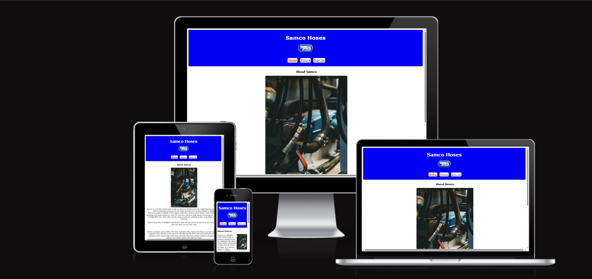
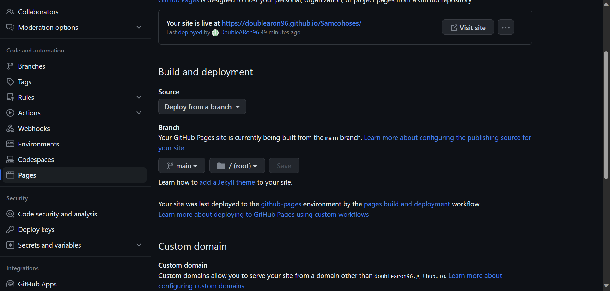

# Samco Sports

[Visit the website here](https://doublearon96.github.io/Samcohoses/index.html)

## Welcome

This website aims to show and promote a company that sells silicon hoses and works with
famous racers in the motorsport world.

This Website has the following pages of content:

1. Home/About
2. gallery
3. Sign up page
4. complete submit page

The business goals set for this project are:

1. To expand Samco's presence online.
2. get more people signed up for our newsletters.
3. To increase sales of UK customers.
4. also get more people to have a look at our social networking sites.

---

## UX

While planning and taking in the principles of UX, planning how it will bring in the audience and future customers.

Samco Website Target audience:

* ages between 18 to 40
* Motor vehicle Enthusiast
* people who have an interest in motorsports
* Small companies looking to sell new products
  
What the clients will be looking for:

* Easy way to get information about the products and company
* Clear and high-quality Pictures of the products
* where they can get in contact and get news on new products
  
the plan is to hit all of these targets and keep improving and adapting.

the website is responsive to cover all bases because the age range we are aiming for the site covers both mobile to full-screen computers.

### Structure

the website is a three-page website with a nav bar to get around with ease. the first page covers the information with a picture to show a hose in use. All pages have all socials at the bottom of each page in the footer for ease of access.

the second page has a big gallery to show all different types of hoses, this also will have a few pictures with just the products so the clients can see what they will receive in the post.

the third page will have a sign-up form so they can receive new and product information and when you fill out the form fully the first name last name and email will be required and the three check boxes under will be up to the client.

### Scope

To help achieve our company goals the full deployment will have:

* Header and menu bar, to navigate all sections
* Information on the company and the products produced
* Videos of the production
* sign up page to get in contact with the clients
* downloadable catalog
* links to social media forms
* Newsletter sign-up form

### Surface

the colour scheme I choose was to match the Samco company and keep with their colour scheme

I also used Verdana font because it was nice and worked well with the site shape all the other fonts I tired just didn't feel right

### Features

### Nav bar

### About

### Gallery

### Sign up

### Submit Page

### Technologies Used

### Testing

### Deployment

1. Log in to GitHub
2. In your Repository section, select the project repository that you want to deploy
3. In the menu located at the top of this section, click 'Settings'
4. Select 'Pages' on the left-hand menu - this is around halfway down
5. In the source section, select branch 'main' and save
6. The page is then given a site URL which you will see above the source section, it will look like the following:

Please note it can take a while for this link to become fully active.

*Forking the GitHub Repository*

If you want to make changes to your repository without affecting it, you can make a copy of it by 'Forking' it. This ensures your original repository remains unchanged.

1. Find the correct GitHub repository
2. In the top right corner of the page, click the Fork button
3. Your repository has now been 'Forked' and you have a copy to do what you want to.

*Cloning the GitHub Repository*

Cloning your repository will allow you to download a local version of the repository to be worked on. Cloning is a good way to back up your work and have a spare copy

1. Find the relevant GitHub repository
2. Press the arrow on the Code button
3. Copy the link that is shown in the drop-down
4. Now open Gitpod & select the directory location where you would like the clone created
5. In the terminal type 'git clone' & then paste the link you copied into GitHub
6. Press enter and your local clone will be created.

---

## Credits

Problems

I tried multiple times to make a checkbox drop-down but just couldn't get it to work so I made the three tabs look good in all screen sizes and make sure they fit all.

code I used from other sources
I used the code from the social links at the bottom
Happy coding!
